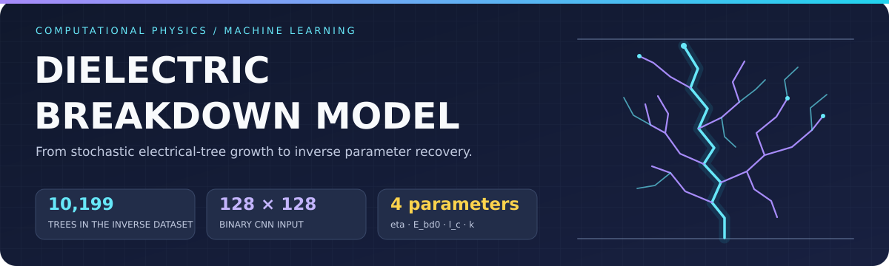
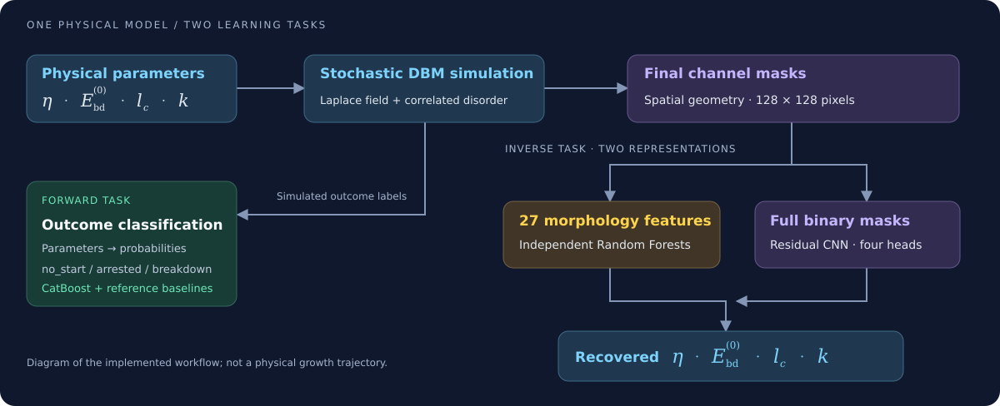
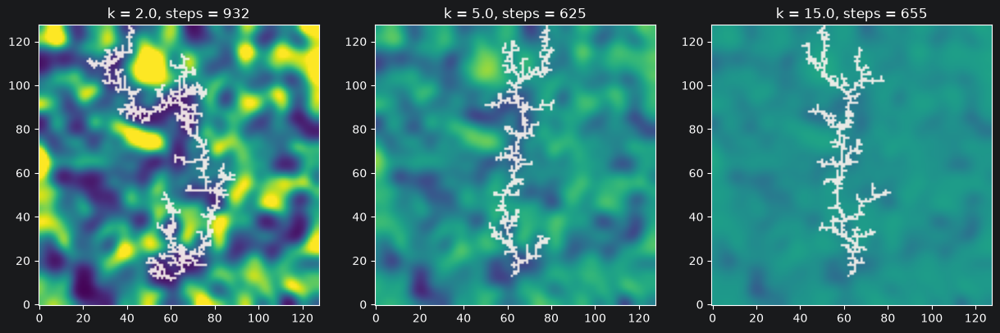
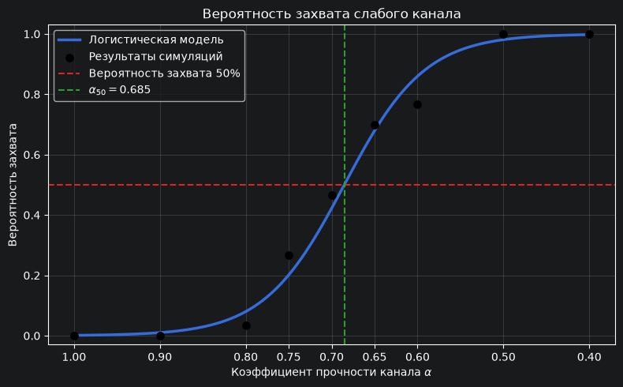
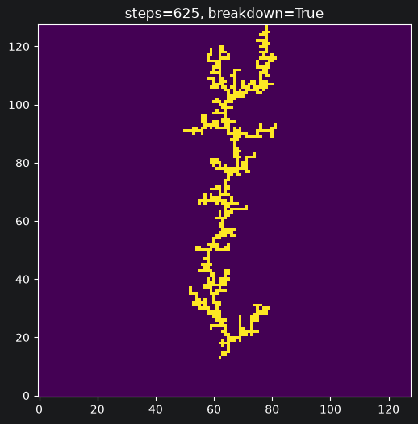
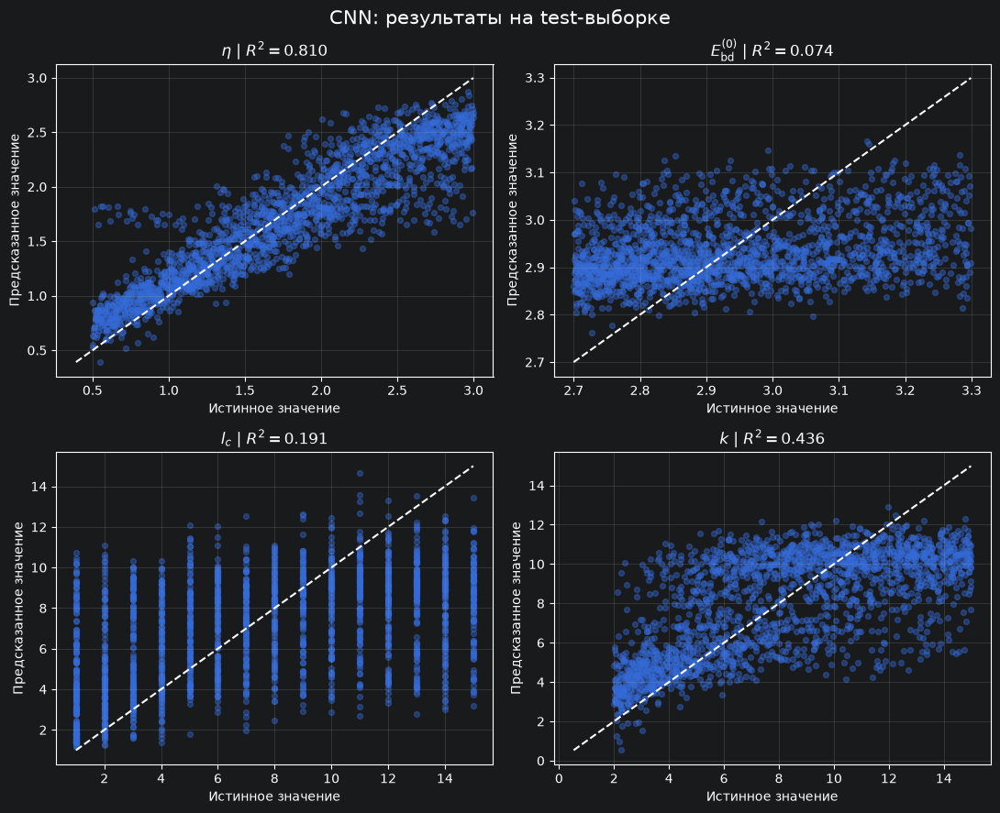

<h1 align="center">Dielectric Breakdown Model</h1>

<p align="center">
  <strong>Electrostatics · Stochastic growth · Material disorder · Inverse learning</strong>
</p>

<p align="center">
  <a href="#technology-stack">Stack</a> ·
  <a href="#physical-model">Physics</a> ·
  <a href="#simulation-morphology-and-statistics">Statistics</a> ·
  <a href="#forward-machine-learning-problem">Forward ML</a> ·
  <a href="#inverse-parameter-estimation">Inverse ML</a> ·
  <a href="#independent-test-results">Results</a> ·
  <a href="#repository-structure">Repository</a>
</p>

---

A Python research project on electrical-tree growth in heterogeneous dielectrics. The project combines electrostatic simulation, statistical analysis, and machine learning to study discharge initiation, channel morphology, breakdown probability, and inverse parameter recovery.

The central question is whether the geometry of an electrical tree retains enough information to recover the material-disorder and growth parameters that generated it. To investigate this, the same simulator supports controlled physical experiments, probabilistic outcome prediction, and two complementary inverse models.

| Research layer | Question | Output |
|---|---|---|
| **Physical simulation** | How does a conductive channel evolve in a heterogeneous dielectric? | Channel geometry, growth history, and discharge outcome |
| **Forward learning** | Given the generating parameters, how likely is each outcome? | Probabilities of no initiation, arrested growth, and breakdown |
| **Inverse learning** | Given the final channel, which generating parameters can be recovered? | Estimates of eta, E_bd0, l_c, and k, with parameter-specific diagnostics |



> **Scope.** This is a synthetic, two-dimensional research model. The current ML results concern recovery within the simulated distribution; they do not establish experimental parameter recovery in real dielectric samples.

---

## Technology stack


The project is built around **Python**, with three connected layers: numerical simulation, statistical analysis, and machine learning. Numba accelerates the numerical kernels, Joblib parallelizes simulation runs, and PyTorch learns spatial representations directly from channel masks.

| Area | Technologies | Application |
|---|---|---|
| Language and workflow | Python, Jupyter | Modular simulation code and step-by-step research notebooks |
| Numerical computing | NumPy, SciPy | Grid operations, correlated fields, Weibull transforms, Sobol sampling |
| Performance | Numba, Joblib | JIT-compiled solver kernels and parallel Monte Carlo runs |
| Data processing | pandas, JSONL, CSV | Simulation records, sampling plans, and grouped datasets |
| Statistics | SciPy, statsmodels | Bootstrap, permutation tests, repeated-measures tests, and multiple-testing correction |
| Classical machine learning | scikit-learn, CatBoost | Outcome classification, grouped validation, calibration, and feature-based regression |
| Deep learning | PyTorch | Mask datasets, residual CNNs, regression heads, and training workflows |
| Visualization | Matplotlib, Seaborn, tqdm | Scientific figures, diagnostic plots, and progress monitoring |



*Examples from [05_disorder_growth.ipynb](notebooks/05_disorder_growth.ipynb). These are individual realizations, not statistical estimates of parameter effects.*

---

## Physical model

### Electrostatics and geometry

The dielectric is represented by a two-dimensional grid between electrodes. A conducting needle seeds the discharge. The lower electrode, needle, and growing channel are held at zero potential; the upper electrode is held at the imposed voltage. The lateral boundaries use a zero-normal-gradient approximation.

At each growth step, the potential is obtained from a finite-difference approximation of the **Laplace equation** in the nonconducting region. A successive over-relaxation (**SOR**) solver, accelerated with Numba, updates the potential until the residual criterion or iteration limit is reached. The local electric field is calculated from the negative spatial gradient of the potential.

Adding a conductive cell changes the boundary geometry, so the field is solved again before the next cell is selected. This creates feedback between channel shape and field concentration rather than evolving the tree in a fixed background field.

### Spatially correlated material disorder

The simulator assigns a positive local strength to every grid cell. Its construction separates the **spatial organization** of disorder from the **spread of strength values**:

1. Generate Gaussian white noise using `disorder_seed`.
2. Apply Gaussian spatial smoothing controlled by `correlation_length`.
3. Standardize the smoothed field and map it through the Gaussian cumulative distribution function.
4. Apply an inverse Weibull transform with `weibull_shape` and a theoretical unit-mean scale.

The resulting field is a correlated Weibull-type strength map. The transform is designed around Gaussian marginals; finite-grid standardization does not guarantee an exact empirical Weibull distribution in every realization. The nonlinear transform also means `correlation_length` is a construction parameter, not an automatically calibrated physical correlation length in metres.

The global threshold scale `mean_breakdown_field` multiplies this local strength. Thus, E_bd0 changes the overall growth threshold, l_c changes the spatial arrangement of weak regions, and k changes the variability of the underlying strength distribution.

### Thresholded stochastic growth

Candidate cells are nonconducting, four-connected neighbours of the needle or existing channel. For each candidate, the code compares the field magnitude with the local threshold and computes a growth weight:

```python
local_threshold = mean_breakdown_field * local_strength
growth_weight = max(local_field / local_threshold - 1.0, 0.0) ** eta
```

Only candidates strictly above threshold are active. Their weights are normalized into a categorical probability distribution, and one cell is sampled using `random_seed`. Larger eta favours candidates with greater field excess; it changes stochastic selectivity rather than setting a physical growth velocity.

If no active candidate remains, growth stops. If the channel reaches the upper electrode, the run is classified as breakdown. The solver therefore couples deterministic electrostatics, frozen material disorder, and stochastic channel selection.

### Physical parameters

Parameter labels used in figures and their code names are linked explicitly below.

| Label | Code name | Meaning |
|---|---|---|
| eta (η) | `eta` | Field sensitivity of stochastic growth; affects growth selectivity and directionality |
| E_bd0 | `mean_breakdown_field` | Baseline breakdown-threshold scale multiplying the local disorder strength |
| l_c | `correlation_length` | Spatial smoothing/correlation parameter for the material-disorder field, expressed in grid units |
| k | `weibull_shape` | Weibull shape parameter controlling the strength-distribution variability |

Material and growth randomness are controlled separately by `disorder_seed` and `random_seed`.

| Outcome | Interpretation |
|---|---|
| `no_start` | The needle cannot initiate channel growth under the local field and strength conditions |
| `arrested` | A channel forms but stops before reaching the target electrode |
| `breakdown` | The channel reaches the target electrode |

Runs that exhaust the configured step limit must be handled separately according to the dataset-generation notebook rather than automatically labelled as arrested.

> **Physical limits.** The model is quasi-static and lattice-based. It does not explicitly resolve charge transport, heating, chemical damage, or physical propagation time. Growth-step counts describe algorithmic evolution, not a calibrated speed. The present implementation is a DBM-style simulator, not a phase-field model.

---

## Simulation, morphology, and statistics

- Joblib-parallelized Monte Carlo runs, Sobol parameter sampling, adaptive refinement near outcome transitions, and incremental JSONL storage.
- 27 morphology features, including area, depth, width, anisotropy, branch counts and lengths, sinuosity, fractal dimension, lacunarity, and radial mass profiles.
- Controlled straight and Y-shaped low-strength paths for studying guided growth and branch selection.
- Bootstrap intervals, permutation tests, Friedman repeated-measures tests, and Wilcoxon post-hoc comparisons with Holm correction.

### From simulated channels to measurable geometry

The final mask is converted into a 27-dimensional morphology representation. These descriptors summarize different aspects of the same channel, providing physically interpretable inputs for the feature-based inverse model.

| Descriptor family | Examples | Information captured |
|---|---|---|
| Size and penetration | Area, area fraction, depth and height fractions | How much of the sample is occupied and how far growth extends |
| Transverse geometry | Width fraction, transverse spread, aspect ratio, centroid offset, anisotropy | Lateral dispersion and overall directionality |
| Branch topology | Endpoints, branching points, branching density, branch lengths | Complexity and distribution of channel branches |
| Path geometry | Main-path length, sinuosity, side-branch fraction | Tortuosity and allocation of growth between principal and side paths |
| Multiscale structure | Fractal dimension, lacunarity, radial mass profiles | Space filling, gaps, and spatial mass distribution |

### Controlled experiments and sampling

Parameter sweeps investigate changes in initiation, traversal, and morphology. Sobol sampling provides coverage of the four-dimensional parameter space; adaptive sampling places additional simulations near estimated outcome transitions. Repeated runs distinguish changes in the material realization from changes in stochastic growth.

Prescribed low-strength straight paths and Y-shaped paths provide controlled geometry: straight-path experiments quantify capture by a weak region, while Y-shaped experiments investigate branch preference when competing paths have different strengths. The sigmoid below summarizes one such capture experiment.

Statistical comparisons account for repeated trajectories sharing a material realization rather than treating every trajectory as independent. Detailed experiments are available in notebooks [07](notebooks/07_disorder_seed_analysis.ipynb), [08](notebooks/08_weibull_k_analysis.ipynb), [09](notebooks/09_correlation_length_analysis.ipynb), [10](notebooks/10_eta_analysis.ipynb), [11](notebooks/11_threshold_analysis.ipynb), and [12](notebooks/12_joint_parameter_sweep.ipynb).

### Guided-growth transition



*Sigmoid from [13_controlled_week_path.ipynb](notebooks/13_controlled_week_path.ipynb): empirical capture frequencies and a fitted logistic curve versus the prescribed channel strength factor alpha. Lower alpha means a weaker path. The fitted 50% capture point is approximately alpha = 0.685 for this experiment, not a universal material constant.*

---

## Forward machine-learning problem

Models estimate discharge-outcome probabilities from `eta`, `mean_breakdown_field`, `correlation_length`, and `weibull_shape`.

Different material realizations and stochastic trajectories can produce different outcomes for the same parameter combination. The learning target is therefore a **distribution over outcomes**, not a deterministic physical boundary. The classifier provides a surrogate for these outcome statistics; it does not replace the simulator's channel-generation mechanism.

### Models and their roles

| Model | Role |
|---|---|
| Dummy classifier | Empirical-prior reference baseline |
| Logistic regression | Standardized linear probabilistic baseline |
| Random Forest | Nonlinear ensemble with leaf-size regularization |
| Class-weighted Random Forest | Rare-outcome precision–recall analysis |
| CatBoost | Primary probabilistic classifier in the current experiments |

Model selection uses grouped validation, keeping repeated physical parameter combinations within the same fold. Evaluation includes multiclass log loss, balanced accuracy, confusion matrices, calibration, permutation importance, and separate diagnostics for the rare `arrested` outcome.

The logistic baseline standardizes the numerical inputs. The Random Forest experiments assess nonlinear interactions and leaf-size regularization. CatBoost uses multiclass gradient boosting to capture nonlinear dependencies without manually specifying interaction terms. Grouped cross-validation supplements the held-out validation analysis for selected baselines.

### Probability quality and rare outcomes

Accuracy alone can conceal failure on the relatively rare arrested-growth class. The evaluation therefore combines several complementary checks:

| Diagnostic | Purpose |
|---|---|
| Multiclass log loss | Penalizes incorrect, overconfident probabilities |
| Balanced accuracy and confusion matrices | Separates class-specific performance from majority-class prevalence |
| Calibration curves | Compares predicted probabilities with empirical outcome frequencies |
| Precision–recall analysis for `arrested` | Examines detection of a rare but physically important outcome |
| Permutation importance | Measures predictive reliance on each generating parameter |

Group-based splitting prevents repeated trajectories from the same physical parameter point from appearing on both sides of a train/validation comparison. Seed-disjointness assertions add a check against sharing material realizations. Predictive feature importance is interpreted as a model diagnostic, not a standalone causal measurement.

---

## Inverse parameter estimation

The inverse task estimates the four generating parameters from an already formed electrical tree. The input contains channel geometry, but not the hidden strength map or the complete growth trajectory. Multiple parameter combinations can therefore yield similar observations; parameter recovery must be assessed separately for each target.

Two learned approaches compare **interpretable engineered geometry** with **direct spatial representation learning**:

| Model | Input |
|---|---|
| Median baseline | Constant prediction from training targets |
| Random Forest | 27 engineered morphology features |
| Residual CNN | Binary 128 × 128 channel mask |



*A simulated channel from [05_disorder_growth.ipynb](notebooks/05_disorder_growth.ipynb), illustrating the type of spatial input used by the CNN. This example is not an inference result.*

The inverse dataset contains 10,199 trees:

| Split | Samples |
|---|---:|
| Train | 6,560 |
| Validation | 1,706 |
| Test | 1,933 |

Train/validation grouping uses `point_id`; notebook assertions check that parameter points and disorder seeds do not overlap between the relevant splits. Target-normalization statistics are computed from training data only.

### Feature-based Random Forest

The morphology branch trains **one regressor per target**, allowing different parameters to use different regularization settings. A median imputer handles missing feature values inside the fitted pipeline. A constant training-median baseline measures whether morphology adds predictive information beyond a simple central-value estimate.

Candidate forests are selected by validation MAE using combinations of feature subsampling, minimum leaf size, and maximum depth. Validation permutation importance identifies which geometric descriptors support each target. After selection, the final forests are refitted on train + validation with 600 trees per regressor and evaluated on the test split.

This branch supplies a transparent reference for the CNN: if a parameter is already recoverable from size, branching, and directionality descriptors, a more complex image model need not improve it.

### Residual CNN

The model has **1,403,332 trainable parameters**: four residual convolutional blocks, progressive downsampling, combined adaptive average and maximum pooling, a shared 128-dimensional representation, and four separate regression heads.

Unlike the feature-based model, the CNN receives the full binary mask and can learn the spatial arrangement of branches, gaps, and local channel structure. It is a custom residual network trained from scratch, not a pretrained transfer-learning backbone.

| Stage | Representation | Function |
|---|---|---|
| Input | 1 × 128 × 128 | Single-channel binary tree mask |
| Residual encoder | Channels 1 → 16 → 32 → 64 → 128 | Four blocks learn progressively richer spatial features |
| Downsampling | 128 → 64 → 32 → 16 → 8 pixels per side | Max pooling after each block reduces spatial resolution |
| Dual adaptive pooling | Average + maximum pools, each 128 × 4 × 4 | Combines distributed activation with strong local responses |
| Shared representation | 4,096 → 256 → 128 | Compresses pooled features into a common embedding |
| Four regression heads | 128 → 32 → 1 for each target | Produces one normalized estimate per physical parameter |

Each residual block uses two 3 × 3 convolutions with batch normalization and ReLU. A skip connection adds the block input to the learned transformation; a 1 × 1 projection matches channel counts when needed. Spatial dimensions are preserved inside each block so that residual addition is well-defined. Dropout regularizes the shared layers and target-specific heads.

### Training and evaluation

Targets are standardized using training-set means and standard deviations. This prevents parameters with larger numerical scales from dominating the joint loss. Predictions are transformed back to their original simulation units before reporting regression metrics.

| Component | Implementation | Role |
|---|---|---|
| Dataset | Float32 binary masks and four normalized targets | Consistent image/target pairing |
| Augmentation | Random horizontal reflection on training masks | Uses left–right symmetry without reversing the growth direction |
| Loss | `SmoothL1Loss`, beta = 1.0 | Quadratic near zero error, linear for larger normalized errors |
| Optimizer | `AdamW`, initial learning rate 0.001, weight decay 0.0001 | Gradient-based parameter updates with weight regularization |
| Learning-rate control | `ReduceLROnPlateau` | Reduces the learning rate when validation improvement stalls |
| Model selection | Early stopping and lowest-validation-loss checkpoint | Selects the CNN without optimizing against test performance |
| Reported metrics | MAE, RMSE, and R² per parameter | Measures errors in original units and explained target variation |

During training, gradients are computed and model weights are updated. Validation and test passes do not update weights. The experiments train one CNN through successive epochs; they are not a parallel hyperparameter search or an ensemble of independent CNNs.

---

### Independent-test results

MAE is reported in each target's original simulation units; R² is the coefficient of determination. MAE values for different parameters are not directly comparable because their scales differ.

| Target | CNN MAE | CNN R² | Random Forest MAE | Random Forest R² |
|---|---:|---:|---:|---:|
| eta | 0.2369 | 0.810 | 0.2276 | 0.815 |
| E_bd0 | 0.1326 | 0.074 | 0.1374 | 0.053 |
| l_c | 3.1719 | 0.191 | 3.5317 | 0.084 |
| k | 2.2629 | 0.436 | 2.5486 | 0.312 |



*Four CNN test-set panels from [19_cnn_inverse.ipynb](notebooks/19_cnn_inverse.ipynb). Each panel compares true and predicted values; the dashed diagonal represents exact recovery.*

**Protocol note:** the final Random Forest is refitted on train + validation; the reported CNN uses training samples only, with validation for checkpoint selection. These are the evaluated workflows, not a strictly equal-training-budget comparison. The table reports one CNN training run and does not establish statistical significance of the differences.

### Interpretation and limitations

- **eta:** both models recover this parameter well on the current synthetic test set.
- **l_c and k:** CNN reduces MAE relative to the final Random Forest by about 10.2% and 11.2%, respectively. This supports the usefulness of learned spatial representations, although l_c recovery remains weak in absolute terms.
- **E_bd0:** both models achieve low R². Weak recovery is consistent with its role in initiation and the selection of already formed trees; it does not prove that every possible method or observation would fail.
- Extreme predictions tend toward central values. This may reflect ambiguous morphology, finite data, model bias, or their combination; additional experiments are needed to separate these causes.
- Hand-engineered features are derived from the same mask: they offer an inductive bias, not an independent measurement.
- These results validate recovery within the simulated dataset, not transfer to real dielectric experiments.

The current test set has already been examined. Further model development should use training/validation data, with a new locked final test for confirmatory evaluation.

---

## Repository structure

Source and documentation layout; ignored datasets, checkpoints, and result directories are intentionally omitted.

| Location | Contents |
|---|---|
| `src/` | Configuration, electrostatic solver, disorder fields, defects, channel growth, and morphology extraction |
| `notebooks/` | Numerical experiments, statistics, dataset construction, and ML evaluation |
| `docs/images/` | Versionable README assets: vector graphics and scientific figures |
| `requirements.txt` | Python dependency declarations |
| `README.md` | Research overview, physical assumptions, models, and current results |

### Main notebooks

| Notebook | Purpose |
|---|---|
| [13_controlled_week_path.ipynb](notebooks/13_controlled_week_path.ipynb) | Controlled weak-path experiments and logistic capture analysis |
| [15_dataset_generation.ipynb](notebooks/15_dataset_generation.ipynb) | Parameter sampling and simulation dataset generation |
| [16_ml_baselines.ipynb](notebooks/16_ml_baselines.ipynb) | Forward classification and probability calibration |
| [17_morphology_dataset.ipynb](notebooks/17_morphology_dataset.ipynb) | Morphology extraction and inverse dataset construction |
| [18_inverse_ml.ipynb](notebooks/18_inverse_ml.ipynb) | Feature-based inverse regression and Random Forest selection |
| [19_cnn_inverse.ipynb](notebooks/19_cnn_inverse.ipynb) | Residual CNN training and inverse-model comparison |
---

<p align="center"><strong>Physics generates the observations. Statistics tests the effects. Machine learning probes what the morphology retains.</strong></p>
